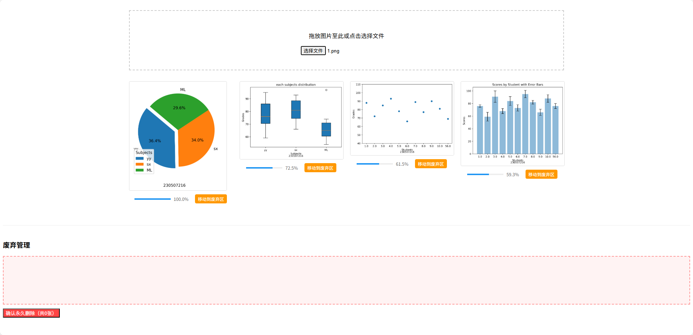

# Image Similarity Search with Deep Learning

A web application that allows users to:
- Upload an image to find visually similar images
- Manage unwanted images with a trash system
- View and navigate through results in an intuitive interface

## Key Features
- **🔍 Deep Learning-based Search** - Uses ResNet-50 to extract image features and find similar images  
- **🗑️ Smart Trash Management** - Mark unwanted images and batch delete them  
- **🖼️ Interactive Gallery** - View enlarged images with keyboard navigation (← → arrows)  
- **⚡ FastAPI Backend** - Efficient Python backend for image processing  
- **🖥️ Modern UI** - Clean interface with drag-and-drop functionality  

## Technology Stack
- **Frontend**: HTML5, CSS3, JavaScript
- **Backend**: Python, FastAPI
- **Deep Learning**: PyTorch, ResNet-50
- **Feature Storage**: HDF5
- **Deployment**: Uvicorn ASGI server

Perfect for organizing photo collections, finding duplicate images, or building recommendation systems!
# Usage
- install
```
pip install fastapi uvicorn numpy pillow h5py torch torchvision
```
- run
```
python main.py
```
- address：localhost:8000


# About Me
## AI Algorithm Engineer

### Professional Focus
- Specializing in computer vision and deep learning algorithms
- Passionate about developing practical AI solutions

### Technical Writing
- Regularly share algorithm insights on [Zhihu](https://www.zhihu.com/people/wei-shen-ne-43) 
- Content covers:
  - Cutting-edge AI/ML techniques
  - Practical implementations
  - Algorithm deep dives

## Let's Connect
- Follow for technical posts and discussions
- Open to collaborations and knowledge exchange